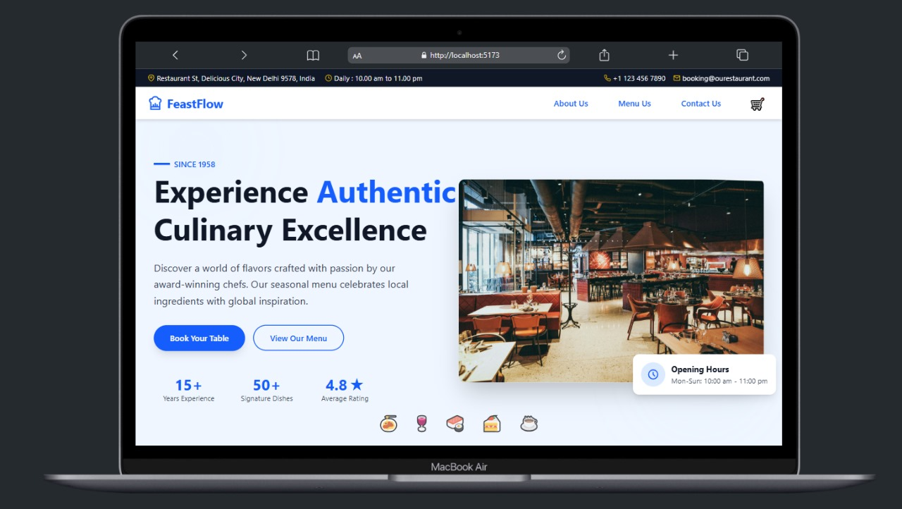

# 🍽️ Restaurant Management System

A responsive, modern restaurant-themed web application built using **React.js** and **Tailwind CSS**. This project showcases an interactive and animated "About Us" section, including staff profiles, dynamic counters, and carousel-like navigation.

## 🚀 Features

- 🖼️ Responsive design for all screen sizes
- 👨‍🍳 Dynamic and animated staff member showcase
- 🧮 Animated counters for experience and dishes
- 🎨 Clean UI with Tailwind CSS
- 🧭 Staff carousel with next/prev navigation
- 💡 Fully modular and reusable components

## 📸 Screenshots


*Customize screenshots based on your final deployment*

## 🛠️ Tech Stack

- **React.js** – Frontend framework
- **Tailwind CSS** – Styling
- **React Icons** – Icons
- **Framer Motion (optional)** – For animations
- **Custom Hooks & Components** – For counters and carousel

## 📁 Project Structure


## 🧑‍💻 How to Run Locally

```bash
# Clone the repository
git clone https://github.com/kutubofficial/Restaurant-Management-System.git

# Navigate into the project
cd Restaurant-Management-System

# Install dependencies
npm install

# Run the development server
npm run dev
